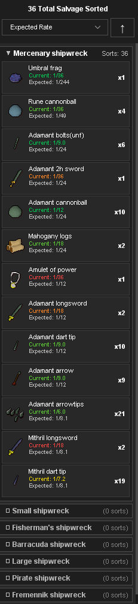
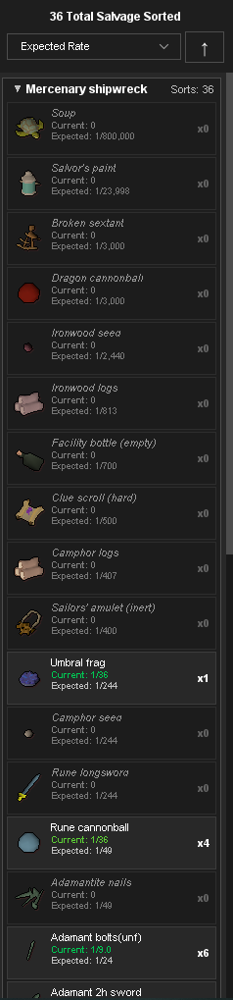
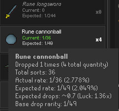

# Salvage Sack

A RuneLite plugin for Old School RuneScape that tracks salvage loot from the Sailing skill, organized by shipwreck type.


<p align="center">
  
  
  
</p>

## Features

### 📊 Comprehensive Tracking
- **Track by Shipwreck Type**: Separate tracking for all 8 shipwreck types:
  - Small shipwrecks (Small salvage)
  - Fisherman's shipwrecks (Fishy salvage)
  - Barracuda shipwrecks (Barracuda salvage)
  - Large shipwrecks (Large salvage)
  - Pirate shipwrecks (Plundered salvage)
  - Mercenary shipwrecks (Martial salvage)
  - Fremennik shipwrecks (Fremennik salvage)
  - Merchant shipwrecks (Opulent salvage)

### 📈 Drop Rate Analysis
- **Current Drop Rate**: Your actual drop rate based on your sorts
- **Expected Drop Rate**: Wiki-sourced expected rates for comparison
- **Luck Indicator**: Color-coded display showing if you're running lucky (green), neutral (yellow), or unlucky (red)

### 🎨 Visual Display
- **Item Icons**: Displays actual item icons from the game (including untradeables like Boat bottles and Sailors' amulets)
- **Quantity Tracking**: Shows total quantity received for stackable items
- **Collapsible Sections**: Accordion-style panels for all 8 shipwreck types (browse full drop tables even before sorting)
- **Show Unobtained Drops**: Configurable option to display items you haven't received yet (dimmed out) to easily track dry streaks on rare uniques
- **Fractional Odds ("1 in X")**: Display drop rates as standard OSRS odds (e.g., 1/750) or percentages
- **Detailed Tooltips**: Hover over any item to view detailed stats: drop count, total quantity, total sorts, expected drops, luck ratio, and dry streak analysis
- **Auto-Sorted Sections**: Most recently updated shipwreck always appears at the top
- **Flexible Sorting**: Sort items by alphabetical name, current rate, expected rate, quantity, or luck with ascending/descending options

### 💾 Persistent Data
- All tracking data is automatically saved between sessions using RSProfile storage
- Debounced saving minimizes disk/config overhead during rapid sorting
- Sort preferences and expansion states persist across restarts

## Installation

### From Plugin Hub (Recommended)
1. Open RuneLite
2. Click the wrench icon to open Configuration
3. Click "Plugin Hub" at the bottom
4. Search for "Salvage Sack"
5. Click Install

### Manual Installation (Development)
1. Clone this repository
2. Build with Gradle: `./gradlew build`
3. Run with: `./gradlew runClient`

## How to Use

### Basic Usage
1. **Enable the Plugin**: After installation, the plugin is enabled by default
2. **Open the Panel**: Click the Salvage Sack icon in the RuneLite sidebar (ship icon)
3. **Go Sailing**: Sort through salvage from shipwrecks as you normally would
4. **View Statistics**: The panel automatically updates with your loot data

### Reading the Panel

#### Header
- Displays total number of sorts across all shipwreck types
- **Sort Controls**: Dropdown menu and direction toggle for customizing item display order

#### Sorting Options
Items within each shipwreck section can be sorted by:
- **Alphabetical**: Sort by item name (A-Z or Z-A)
- **Current Rate**: Sort by your actual drop rate
- **Expected Rate**: Sort by the wiki expected drop rate
- **Quantity**: Sort by total quantity received
- **Luck**: Sort by luck (how your drop rate compares to expected)
  - Descending: Shows luckiest items (green) first, then neutral (yellow), then unlucky (red)
  - Ascending: Shows unlucky items (red) first, then neutral (yellow), then lucky (green)

Click the arrow button (↑/↓) to toggle between ascending and descending order. Your sort preference is automatically saved.

#### Shipwreck Sections
Each shipwreck type has a collapsible section showing:
- **Section Header**: Shipwreck name and total sorts for that type
- **Arrow Icon**: Click to expand/collapse the section
- **Auto-Sorting**: The most recently updated shipwreck automatically moves to the top of the panel
- **Item Rows**: Each item you've received, showing:
  - Item icon (32x32)
  - Item name
  - Current drop rate (your actual rate)
  - Expected drop rate (from wiki data)
  - Total quantity received

#### Drop Rate Colors
- 🟢 **Green**: You're getting this item more often than expected (lucky!)
- 🟡 **Yellow**: Drop rate is close to expected
- 🔴 **Red**: You're getting this item less often than expected (unlucky)

### Resetting Data

**Right-click** on any shipwreck section header to access reset options:
- **Reset [Shipwreck] Data**: Clears data for just that shipwreck type
- **Reset All Data**: Clears all salvage tracking data

A confirmation dialog will appear before any data is deleted.

## Drop Rate Data

The plugin includes expected drop rates sourced from the OSRS Wiki for all items from each salvage type. This data is stored in `drop_rates.json` and can be customized if needed.

### Customizing Drop Rates
1. Navigate to `.runelite/salvagesack/`
2. Edit `drop_rates.json` to modify expected rates
3. Restart RuneLite to apply changes

## Technical Details

### Requirements
- RuneLite client
- Java 11 or higher
- OSRS membership (Sailing skill access)

### Data Storage
- **Loot Data**: Automatically persisted in RuneLite's per-account RSProfile configuration. Legacy tracking data from `~/.runelite/salvagesack/salvage-data.json` is automatically migrated on first startup.
- **Drop Rate Configuration**: `~/.runelite/salvagesack/drop_rates.json` stores customizable expected drop rates.

### Building from Source

```bash
# Clone the repository
git clone https://github.com/BugcatcherBill/SalvageSack.git
cd SalvageSack

# Build the plugin
./gradlew build

# Run RuneLite with the plugin loaded
./gradlew runClient
```

## FAQ

**Q: Why isn't my loot being tracked?**
A: Make sure you're sorting salvage (not just looting). The plugin detects the chat message "You sort through the [type] salvage and find..."

**Q: Where is my data stored?**
A: Tracking data is securely stored per-character in RuneLite's RSProfile configuration and synced across devices if you use RuneLite sync. Previous data in `~/.runelite/salvagesack/salvage-data.json` is migrated automatically.

**Q: The drop rates seem wrong. Can I update them?**
A: Yes, you can edit `drop_rates.json` in `~/.runelite/salvagesack/`. The default rates are sourced from the OSRS Wiki.

**Q: How do I reset just one shipwreck type?**
A: Right-click on the shipwreck section header in the panel and select "Reset [Shipwreck] Data"

## Contributing

Contributions are welcome! Please feel free to submit issues or pull requests.

## License

This project is licensed under the BSD 2-Clause License - see the [LICENSE](LICENSE) file for details.

## Acknowledgments

- [RuneLite](https://runelite.net/) - The open source OSRS client
- [OSRS Wiki](https://oldschool.runescape.wiki/) - Drop rate data source
- The OSRS community for feedback and testing
